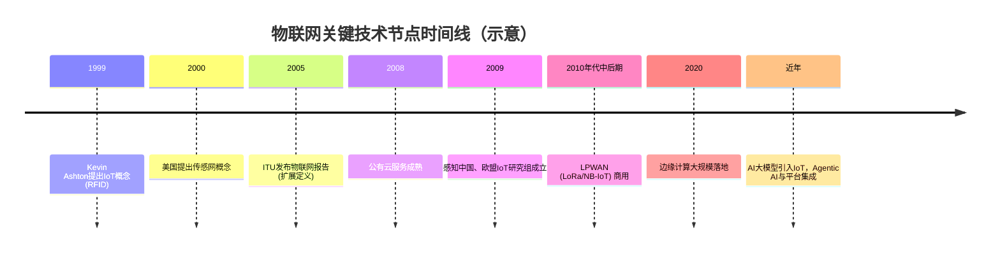

# 第1章 物联网概述：从连接到智能

## 1.1 物联网的三次浪潮：PC互联网→移动互联网→万物互联

设想一个典型的早晨：你被手机闹钟叫醒，拿起手机刷新闻、回消息，出门前用语音指令让智能音箱播放天气。你手机里装着上百个App，但身边还有更多“哑巴”设备——电表、路灯、停车场道闸，它们虽然不会说话，却早已悄悄接入网络，默默上传数据、接受指令。短短三十年，互联网的连接对象从“桌面上的电脑”扩展到“口袋里的手机”，又从“手机”延伸到“周围的每一件实物”。这三次跃迁，分别对应了信息产业的PC互联网、移动互联网和万物互联三次浪潮，每一次都重新定义了“连接”的范围和能力。

### 1.1.1 第一次浪潮：PC互联网时代（20世纪90年代）

PC互联网时代，个人计算机从实验室走入办公室和家庭，成为信息处理的中心。万维网的诞生使原本孤立的PC能够通过有线网络相互连接，浏览网页、收发电子邮件和文件共享成为主流应用。这个阶段的核心特征是“固定终端、有线连接、信息共享”。

从连接规模看，PC互联网浪潮大约连接了10亿用户（资料：[S2]）。这些用户通过调制解调器、以太网电缆固定在桌面，互联网的边界止于消费者的浏览器窗口。终端设备是通用计算机，操作依赖键盘鼠标，交互界面以文本和图形为主。技术基础设施以互联网协议栈为基础，光纤和拨号网络构成骨干，数据中心集中托管服务器。

PC互联网解决了“人找信息”的问题。搜索引擎、电子商务、即时通信等应用开始爆发，但连接的仍然是“人”和“人”或“人”和“信息”，纯粹的物理设备很少直接参与网络对话。这一时期的物联网雏形——射频识别（Radio Frequency Identification, RFID）和传感器网络——尚在实验室中萌芽。1999年，麻省理工学院Auto-ID中心的Kevin Ashton教授在研究RFID时首次提出物联网（Internet of Things, IoT）概念，认为“把所有物品通过射频识别等信息传感设备与互联网连接起来，实现智能化识别和管理”（资料：[S11]）。然而，当时的网络带宽、设备成本和微型化技术都不足以支持大规模设备连接，物联网更多停留在技术探索层面。

### 1.1.2 第二次浪潮：移动互联网时代（21世纪初–2010年代）

移动互联网的普及将互联网的边界从桌面推向了口袋。这一阶段的特征是“智能手机、无线网络、位置服务”。连接规模显著扩大，移动互联网浪潮连接了大约20亿用户（资料：[S2]）。与PC相比，手机天然具备移动性、位置感知和持续在线能力。3G/4G网络提供了足够的带宽，Wi-Fi热点覆盖室内场景。应用形态从浏览器转向原生App，社交、地图、打车、移动支付等成为超级入口。

在移动互联网的推动下，传感器和微型化技术加速成熟。智能手机集成了加速度计、陀螺仪、GPS、摄像头、麦克风等多类传感器，使手机自身成为一个强大的移动物联网节点。与此同时，M2M（Machine-to-Machine）通信开始兴起，车载诊断系统、智能电表、共享单车锁等通过SIM卡接入移动网络，实现了初步的机器互联。不过，此时物联网设备仍然依赖高功耗的蜂窝网络或短距离无线技术（如Wi-Fi、蓝牙），对于大量低功耗、远距离场景并不适用，规模化部署的成本和续航成为瓶颈。

### 1.1.3 第三次浪潮：万物互联时代（2010年代–至今）

低功耗广域网（Low-Power Wide-Area Network, LPWAN）技术如LoRa、NB-IoT、Sigfox相继商用，打破了功耗与距离的权衡。这些技术支持数公里覆盖、数年电池寿命、低成本的模组，使“万物互联”成为经济可行的现实。万物互联浪潮的特征可以概括为“海量终端、低功耗广域网、场景智能”。

从连接数量看，物联网设备数快速增长。PC互联网连接了10亿人，移动互联网连接了20亿人，而万物互联有望将连接数量增加10倍，达到数百亿的量级（资料：[S2]）。行业研究也反复指向同一趋势：全球物联网连接规模仍在持续上升（资料：[S5]）。

第三次浪潮的驱动力来自多个方面：
- **通信技术**：LPWAN、5G mMTC（大规模机器类型通信）、Wi-Fi 6/7为不同场景提供差异化连接方案。
- **终端成本下降**：传感器、微控制器、射频模组价格持续走低，使更多设备可以“上网”。
- **云计算与边缘计算**：云端提供存储和算力，边缘节点兼顾实时性，架构从单一云端走向云-边-端协同。
- **AI能力下沉**：芯片侧和算法侧的发展使终端具备轻量级推理能力。

**表1-1 互联网三次浪潮对比**

| 维度 | PC互联网 | 移动互联网 | 万物互联 |
|------|----------|------------|----------|
| 时间跨度 | 20世纪90年代至21世纪初 | 21世纪初至移动互联网普及阶段 | 2010年代至今 |
| 连接主体 | 桌面电脑 | 智能手机/平板 | 任意物理设备 |
| 连接数量（示意） | ~10亿 | ~20亿 | 数百亿级 |
| 网络类型 | 有线以太网/拨号 | 移动通信网络/Wi-Fi | LPWAN等低功耗广域网络 |
| 主要交互方式 | 键盘鼠标、浏览器 | 触控、App、语音 | 传感器、自动执行、AI对话 |
| 核心应用 | 信息检索、电子邮件、电商 | 社交、位置服务、支付 | 智慧城市、工业互联网、车联网 |
| 典型产品 | PC、路由器 | iPhone、安卓手机 | 智能电表、共享单车、智能音箱 |

> 注：连接数量为行业公认的粗略规模，不同来源定义口径有别，此处引用资料[S2]中的示意数据。

### 1.1.4 三次浪潮的演进逻辑

回顾三次浪潮，每一次都遵循相似的“连接对象扩大+交互方式质变”规律。PC互联网将计算机连成一张网，移动互联网将人（及其随身设备）融入网络，万物互联则把每一个物体变成网络的端点和数据的生产者。这种演进并非简单的数量叠加，而是引发了一次次应用范式、商业模式的颠覆。在第三次浪潮中，设备数量激增的同时，数据的维度、体量和实时性都超出了人类手工处理的能力上限，这使得物联网的下一个瓶颈不再是“连得通”，而是“用得懂”。

正是在这里，AI大模型（如大语言模型，Large Language Model, LLM）的出现为第三次浪潮注入了全新的变量。大语言模型能够理解自然语言、感知多模态信息、进行复杂推理和自主决策。当这种能力与物联网的海量设备结合，物联网将从“被动连接”走向“主动智能”——设备不再只是等待人类下达指令，而是能够基于上下文感知主动提供服务。这一范式冲击将在本章1.4节详细展开。

理清了物联网三次浪潮的宏观脉络之后，接下来我们将注意力转向物联网本身：它的定义是如何演变的？发展历程经历了哪些关键阶段？

## 1.2 物联网的定义与发展历程

“物联网”这个词今天几乎无人不晓，但若追问一句：“你到底指什么？”十个人可能给出十种答案——有的强调传感器，有的聚焦通信协议，有的则认为就是“把东西连上网”。这种定义上的模糊，既是物联网蓬勃多元的体现，也折射出它作为一个技术概念，在近二十年间经历了多次内涵迁移。要理解物联网的本质，不能只看一个定义，而要看它从何而来、往何处去。

### 1.2.1 物联网的定义：多视角下的核心共识

物联网的概念最早可以追溯到1999年。那一年，麻省理工学院Auto-ID中心的Kevin Ashton教授在研究RFID系统时首次明确提出了“Internet of Things”这一术语，其核心设想是“把所有物品通过射频识别等信息传感设备与互联网连接起来，实现智能化识别和管理”（资料：[S11]）。这个朴素的提出背景很有时代特征——Ashton关心的核心问题是“如何让计算机自主获取现实世界的数据，而不依赖人工录入”。RFID标签和读写器在他眼中，正是物与互联网之间的“触点”。需要特别说明的是，Ashton在1999年首次提出了物联网的术语和初步概念，而此后国际电信联盟（ITU）等组织在此基础上进行了更为系统的定义和推广。

此后，不同的国际组织从各自角度对物联网进行了定义，侧重各有不同。

国际电信联盟在2005年发布的《ITU互联网报告2005：物联网》中，对早期以RFID为中心的概念做了显著扩展。报告提出“任何时间、任何地点、任意物体之间的互联”这一愿景，认为物联网是实现无所不在的网络和无所不在的计算的基础设施，除RFID外，传感器技术、纳米技术、智能终端等也将得到广泛应用（资料：[S10]）。这一定义突出“泛在性”，将物联网从实验室推向了普适计算的宏大叙事。

欧盟第7框架下的“RFID和物联网研究项目组”在2009年9月发布的研究报告中给出了一个更偏向工程架构的定义：物联网是未来互联网的一个组成部分，是基于标准的和可互操作的通信协议，具有自配置能力的、动态的全球网络基础架构。其中的“物”都具有标识、物理属性和实质上的个性，能够使用智能接口实现与信息网络的无缝整合（资料：[S10]）。这一定义的核心贡献在于强调了“互操作性和标准化”——没有统一的协议，物联网就是一盘散沙。

我国相关政策语境中常见的定义则更为简明实用：通过信息传感设备，按照约定的协议，把任何物品与互联网连接起来，进行信息交换和通讯，以实现智能化识别、定位、跟踪、监控和管理（资料：[S10]）。这个定义务实，聚焦在“感知-连接-管理”的闭环上，与我国推动物联网产业落地的政策取向高度契合。

**表1-2 三种典型物联网定义对比**

| 维度 | ITU（2005） | 欧盟第7框架研究组（2009） | 中国政府工作报告（2010） |
|------|-------------|---------------------------|---------------------------|
| 核心关注点 | 泛在互联、无时无处不在 | 互操作性、标准化、自配置 | 智能化识别、定位、跟踪、监控 |
| 技术范围 | RFID、传感器、纳米、智能终端 | 标准协议、智能接口、全球网络架构 | 信息传感设备、约定协议 |
| 对“物”的描述 | 任意物体 | 具有标识、物理属性和个性的实体 | 接入网络的任何物品 |
| 应用导向 | 无所不在的计算 | 全球网络基础设施 | 智能化管理 |

对工程师而言，不必纠结于哪一个定义更“权威”。理解物联网更有效的框架，是抓住一个核心共识：**物联网是在互联网基础上延伸和扩展的网络，将各种信息传感设备与互联网结合起来，实现在任何时间、任何地点，人、机、物的互联互通**（资料：[S2]）。

横向对比这几种定义还能发现一个规律：物联网的内涵会随着感知、通信、平台和应用能力扩展而持续变化。早期报告更强调RFID、传感器等感知技术，工程化定义更强调标准化和互操作，面向产业落地的定义则更关注识别、定位、跟踪、监控与管理闭环（资料：[S10]）。这意味着，物联网的定义本身不是静态条文，而是一个会随技术革新和产业场景持续演化的开放框架。

### 1.2.2 早期探索：技术萌芽与概念验证（1999—2008）

Ashton提出物联网概念的早期阶段，核心技术栈并不复杂。RFID被寄予厚望——无源、低成本、可批量读写，理论上可以给每一台冰箱、每一包薯片都贴上标签。Auto-ID中心推动的电子产品代码（Electronic Product Code, EPC）标准和相关的物联网架构，试图为每个物理对象分配一个全球唯一的数字标识，通过互联网查询其详细信息。这个思路在供应链和物流领域找到了最早的试验田（资料：[S11]）。

在同一时期，无线传感器网络（Wireless Sensor Network, WSN）也在独立发展。美国在2000年就提出了传感网（sensor network）概念（资料：[S11]），研究如何将大量微型传感器节点自组织地部署在区域中，协作感知、采集和处理环境信息。与RFID的“被读出”不同，传感器网络强调的是“主动感知、协作传输”，其典型应用包括战场监视、环境监测和工业过程控制。

两种技术路线——RFID的“标识与查询”与WSN的“感知与传输”——构成了早期物联网的两条腿，它们分别对应了物联网定义中“识别”与“感知”两个核心能力。

这一阶段还出现了M2M（Machine-to-Machine，机器对机器通信）的概念。M2M更强调设备之间的自主通信，典型场景包括远程抄表、车载定位、自动售货机补货提示。M2M通常基于蜂窝网络实现，与RFID和WSN相比，它的通信距离更远、组网更成熟，但功耗和成本也更高。

随后，物联网从学术概念逐渐走向产业视野。国际组织的报告、各国政府的关注、标准化组织的介入，都表明这个领域不再是少数研究者的自留地（资料：[S10][S11]）。

### 1.2.3 快速成长：规模化部署与生态成形（2008—2020）

随着云计算、移动互联网和低功耗广域网逐步成熟，物联网进入了加速成长的“青春期”。有两个外部催化剂至关重要。

第一是云计算的成熟。弹性计算、对象存储、消息队列和托管数据库等云服务，让物联网平台无需自建大规模数据中心就可以实现大量设备接入和数据吞吐。物联网的后端基础设施成本大幅下降，中小团队也可以在较短周期内搭建可扩展的平台原型。

第二是移动互联网的普及。智能手机既是物联网的“遥控器”，也成为重要的传感器节点（GPS、加速度计、摄像头）。用户习惯了“用手机控制一切”的交互方式，智能家居、共享单车、运动手环等消费类物联网产品迅速渗透到日常生活。

在通信技术上，低功耗广域网（LPWAN）的商用是这一时期的关键突破。LoRa和NB-IoT等技术以低功耗、较大覆盖范围、低速率和低成本为主要特征，填补了Wi-Fi/蓝牙（短距高速）与蜂窝网络（长距高速）之间的空白。伴随LPWAN的普及，“联网之物”的数量级开始快速抬升。

这一时期，各国政府从战略高度推动物联网产业布局。不同国家和地区围绕标准、产业联盟、示范应用和基础设施建设采取了差异化路径，目标都是把物联网从技术概念推向可规模化部署的产业体系（资料：[S5]）。多国政策的叠加，使物联网从“可选”变成“必选”的基础设施。

在我国，“感知中国”等政策表述推动物联网从技术概念进入国家战略和产业规划视野（资料：[S1]）。随后，传感网标准化、产业规划、示范应用和基础设施建设持续推进，形成了政策牵引、产业配套和应用落地相互促进的发展路径（资料：[S1][S12]）。这一系列政策动作，使中国物联网产业获得了极为强劲的发展动力。

### 1.2.4 智能融合：边缘计算、AI与数字孪生（2020—至今）

当边缘计算、AI和数字孪生逐渐进入工程实践后，物联网进入“智能融合”阶段。这一阶段的核心矛盾不再是“连得上”，而是“用得值”。

关键词之一是边缘计算（Edge Computing）。海量传感器产生的数据如果全部回传云端，网络带宽和延迟成为瓶颈；如果全部在端侧处理，算力又捉襟见肘。边缘计算让运算发生在网络边缘——靠近设备一侧的网关或边缘服务器——既满足实时响应需求，又减轻云端压力。边缘AI芯片的出现，使得在低功耗下运行轻量级推理模型成为可能。

关键词之二是数字孪生（Digital Twin）。数字孪生不是简单的3D可视化，而是在虚拟空间中构建物理实体的数字镜像，实时同步其状态、行为和环境。工厂的数字孪生可以模拟产线调整后的效率变化，城市的数字孪生可以仿真交通管制方案的效果。物与网之间不再只是“上传数据、下发指令”的单向管道，而是形成了“物理世界→数字世界→仿真→决策→物理干预”的闭环。

关键词之三——也是本书后续篇幅将一再展开的主题——是AI，特别是大语言模型（Large Language Model, LLM）与物联网的深度耦合。这一阶段的融合，远不止是在上层的手机App里“AI推荐”几个字，而是从架构层面重构感知、决策和交互的方式。本书中提到的IoT DC3项目提供了一个具体的参照：它把大语言模型接进了运营流程，让模型不只“看数据”，还能“动设备”。DC3构建的Agentic中心基于Spring AI框架，内置10个`@Tool`，通过Tool-Calling让LLM能够查询设备、读写位号、执行命令；MCP（Model Context Protocol，模型上下文协议）则把平台工具安全地暴露给外部AI Agent，支持模型自主决策调用哪个功能（资料：[S7]）。这标志着物联网的平台层正在从“数据管道”升级为“智能操作层”。

**图1-1（示意） 物联网发展历程时间线：1999—近年关键技术节点**



可以看到，物联网这二十多年的轨迹，不是一条平滑的直线，而是多个技术分支交叉、汇聚、裂变的演进网络。从RFID标签到AI Agent，技术的形态在变，但核心命题没有变：**让物能够感知、联网、被理解、被操控**。而每一步突破，都离那个“万物互联，万物智能”的愿景更近一步。

在了解了物联网的定义和发展脉络后，我们再来审视它的产业现状和市场规模，以量化视角把握其经济轮廓。

## 1.3 产业现状与市场规模

从技术萌芽到商业化落地，物联网已经走过了二十多个年头。如果说前十年是“概念预热”和“技术储备”，那么近十年则是“规模爆发”与“产业整合”。今天，物联网不再是一个未来学词汇，而是一个真实存在的、全球性产业。然而，巨大的市场体量背后，各环节的成熟度、竞争格局和盈利模式却千差万别。本节将带领读者鸟瞰全球及中国物联网产业的整体图景，梳理产业链各环节的主要参与者与市场特征。

### 1.3.1 全球物联网产业格局：从碎片化到分层整合

物联网产业链长且复杂，很难用单一的公司或产品来概括。通常，我们可以将物联网产业按技术架构的四个层次来拆解：**感知层、网络层、平台层、应用层**。但在产业分析视角下，更实用的划分方式是按照商业角色分为四大板块：**芯片与模组、通信网络、平台服务、行业应用**。

**1. 芯片与模组：产业“底座”**

这是物联网最“硬”也最核心的环节。芯片决定了设备的计算能力、功耗和成本；模组则将芯片、存储、射频等元器件封装成一个标准化的通信单元，是设备接入网络的“护照”。

- **芯片领域**：这是技术门槛较高、供应链较长的环节。不同连接制式、功耗目标和算力需求，会对应不同类型的通信芯片、低功耗MCU和端侧AI芯片。对工程项目而言，比起记住某个厂商排名，更重要的是理解芯片选型会直接影响设备续航、通信稳定性、端侧推理能力和整机成本。
- **模组领域**：模组将芯片、存储、射频、电源管理等部件封装成可复用的通信单元，降低了终端厂商接入蜂窝、Wi-Fi、蓝牙或LPWAN网络的门槛。模组本身利润空间有限，但它是连接物理世界和数字世界的“管道”；观察模组需求变化，可以间接理解物联网连接规模的变化趋势。

**2. 通信网络：从“尽力而为”到“物联专网”**

物联网对网络的需求与人和手机不同，它更强调低功耗、广覆盖、低成本和大连接。传统移动通信网络虽然能接入设备，但在功耗和成本上并不总是适合低频、小包、长周期的物联场景。为此，业界发展了LPWAN等技术路线，形成了蜂窝与非蜂窝并存的连接格局；更高性能的无线连接能力，也为工业场景提供了新的选项。运营商侧的价值不只在于“卖连接”，还在于连接管理、资费模型、平台接口和行业解决方案的组合能力。

**3. 平台服务：物联网的“中枢神经”**

如果说芯片和模组是物联网的“手脚”，通信网络是“血管”，那么平台就是物联网的“大脑和中枢”。物联网平台的核心功能包括：设备连接管理、数据采集与存储、规则引擎、应用使能（可视化、API集成等）。平台形态大体可以分为两类：一类依托云基础设施，强调托管能力、弹性扩展和与数据分析/AI能力的集成；另一类以开源或私有化部署为主，强调自主可控、可定制和避免厂商锁定。IoT DC3这样的开源平台，为希望深度掌控设备接入、数据流转和行业集成的技术团队提供了一个具体参照。平台层的竞争，核心不只是单点功能，而是**生态、集成效率和长期可控性**的竞争。

**4. 行业应用：物联网价值的最终体现**

这是物联网产业链中规模最大、也最“碎片化”的环节。应用层不像芯片或平台那样可以被少数巨头掌控，而是呈现“千行千面”的特点。典型的应用领域包括：
- **智慧城市**：智能路灯、智能垃圾桶、智慧停车、环境监测、公共安全。
- **智能家居**：智能音箱、智能灯、智能门锁、智能窗帘、扫地机器人。
- **工业物联网（Industrial IoT, IIoT）**：设备预测性维护、生产过程控制、能源管理、资产追踪。
- **车联网**：远程信息处理、车载诊断、自动驾驶。
- **智慧医疗**：远程病人监护、医疗资产管理、药品追溯。
- **智慧农业**：精准灌溉、土壤监测、畜牧追踪。

每个细分领域都有其专属的设备和解决方案提供商。在应用层，成功的关键往往不在于技术本身的领先，而在于对行业Know-How的深刻理解。

### 1.3.2 国内物联网产业现状：政策驱动与规模优势

与欧美由市场和企业主导的模式不同，中国物联网的发展历程中，**政策**扮演了至关重要的“催化剂”和“方向盘”角色。

**1. 政策持续加码**

“感知中国”等政策表述推动物联网进入国家战略和产业规划视野（资料：[S1]）。此后，中国围绕物联网出台了一揽子产业规划和激励政策：

- **战略规划层面**：2011年工信部印发《物联网“十二五”发展规划》，为产业发展绘制了清晰的路线图；2013年国务院发布《关于推进物联网有序健康发展的指导意见》（资料：[S1]），进一步明确了产业方向。
- **财政与投资层面**：中央及地方财政设立了物联网产业发展专项资金，对重大示范项目给予补贴，并通过重点场景建设推动技术从实验室走向行业现场（资料：[S12]）。

**2. 产业链优势与挑战并存**

中国物联网产业的显著优势在于**规模**。中国拥有全球最大的消费电子生产和消费市场，以及世界领先的移动通信网络覆盖（资料：[S12]）。这为物联网提供了“海量终端+连接”的天然沃土。

- **制造能力突出**：在模组、传感器、终端设备等制造环节，中国企业依托成熟的电子产业链、供应链协同和成本控制能力，具备较强的规模化交付能力（资料：[S12]）。
- **平台层竞争激烈**：在国内，多个主要厂商都在推动云、边、端能力协同，平台层服务的标准化和模块化程度持续提升。这客观上降低了中小企业接入物联网平台的门槛，但也要求平台提供商在行业知识、稳定性和持续服务能力上形成差异化。
- **应用层区域色彩浓厚**：国内的物联网应用项目，尤其是智慧城市类项目，往往具有较强的政府推动色彩和区域特性。

**挑战同样不容忽视**：高端传感器、部分核心芯片、工业软件与AI平台能力仍需要持续补齐；数据孤岛问题在跨领域、跨区域时依然较普遍；商业模式上，许多项目仍然停留在“卖硬件”或“收连接费”阶段，在“卖服务”和“卖数据价值”方面还需要更成熟的场景验证。

### 1.3.3 市场规模与连接数量：数字背后的趋势

数字是观察产业冷热的最直观指标。虽然无法提供精确至具体年份的预测数字，但从研究机构的历史数据中，我们可以清晰地看到一条持续向上的增长曲线。

**1. 连接设备数量：指数级增长的“联网之物”**

从PC互联网、移动互联网再到万物互联，连接对象正在从“人和信息”扩展到“设备、环境和生产过程”。尽管不同机构基于不同统计口径给出的预测并不一致，但**世界正在被快速增长的“新移民”——智能设备所填充**，这一点已经成为产业共识。

**图1-2 全球物联网连接设备数年度变化（示意）**
描述：该图表旨在展现连接设备数的增长趋势。
横轴：年份
纵轴：连接设备数量级
柱状图示意（仅表达趋势，不代表精确统计）：
- 较早阶段：联网设备数量相对有限
- 当前阶段：联网设备快速增长
- 后续阶段：预计继续增长

数据来源说明：此图为示意性趋势图，连接数量级呈指数级增长是业界共识，实际精确数字请以IoT Analytics、GSMA、工信部等官方发布的年度报告为准。

**2. 产值与基础设施投入**

物联网产业的产值不仅包括终端设备（传感器、模组、网关等）的价值，还包括平台服务、网络通信、数据处理、应用开发、系统集成等产生的增值。这是一个比连接数更庞大、也更难以精确计算的市场。欧美物联网产业链结构相对成熟，研发能力强，市场认知度高（资料：[S6]）。美国和欧盟通过“智慧地球”、“工业4.0”等战略，从政府层面推动产业创新和标准制定（资料：[S1][S4]），其产值构成中，服务与解决方案的价值占比远高于硬件。

**3. 细分领域：工业与车联网领跑**

从应用场景看，**工业物联网（IIoT）**和**车联网**被视为最具潜力的两大细分市场。工业物联网强调降本增效，通过预测性维护、远程监控等手段，能直接为企业创造价值。车联网则处于消费、通信和交通的交汇点，市场空间巨大。相比之下，消费级物联网（如智能家居、可穿戴设备）虽然出货量惊人，但产品同质化严重，价格战激烈，整体盈利能力偏弱。企业级物联网市场（B2B/B2G）是产业利润的主要来源。

### 1.3.4 章节收束：平台时代的产业逻辑

通过对产业现状与市场规模的审视，我们可以总结出当前物联网产业的几个关键逻辑：
- **万米平地起高台**：产业链已从早期的“碎片化”走向“分层整合”。底层（芯片、模组）和管道层（网络）正变得标准化和商品化，竞争焦点正在向上层（平台、应用、解决方案）和向下层（高性能传感器、AI芯片）两端迁移。
- **规模不再是护城河**：连接数的快速增长是“入场券”，但单一企业的护城河，在于其能否在连接之上构建出**数据壁垒**和**生态壁垒**。也就是说，谁能更好地将连接转化为洞见，将设备管理转化为服务，谁就能在下一个阶段胜出。
- **从“连接为王”到“智能为王”**：产业现状告诉我们，仅靠卖硬件或收连接费，很难支撑长期的高增长。这为下一节的“范式冲击”埋下了伏笔——以大语言模型（LLM）为代表的AI技术，正在改变物联网产业的核心驱动：从“把东西连上网”到“让网上的东西自己思考”。

## 1.4 AI大模型对物联网的范式冲击

当我们站在这几年的技术发展交汇点上回望，一个清晰的转折点已然浮现：如果说前一阶段的物联网核心命题是“如何让更多设备在线”，那么当前的这个命题正在被改写为“如何让在线设备真正理解世界并自主行动”。触发这场转变的，是大语言模型（Large Language Model, LLM）和生成式AI技术的爆发式突破。它带来的不是渐进式的功能升级，而是一次彻底的范式冲击——从“被动连接”走向“主动智能”。

### 1.4.1 从“被动连接”到“主动智能”：一座鸿沟

要理解这场冲击的力度，需要先回看传统物联网系统的工作方式。在传统物联网部署中，智能是“被设计出来”的，而非“涌现出来的”。工程师预先定义好所有的触发条件、规则阈值和执行逻辑，设备只是在冷冰冰地执行预设程序。这种模式可以概括为“被动连接”：设备感知数据，上传至云端，在云端按照固定规则触发指令，最终下发给执行器。整个过程是确定的、可预测的，但也是僵化的、缺乏适应性的。

一位运维工程师管理一个拥有数千个传感器的工厂，他需要手动在监控系统中设定数十条规则：

```python
# 传统规则式控制逻辑（Python伪代码示例）
def handle_sensor_data(sensor_id, temperature, pressure, vibration):
    # 规则1: 温度过高
    if temperature > 85.0:  # 摄氏度
        activate_cooling_system(sensor_id)
        send_alert(f"设备 {sensor_id} 温度异常: {temperature}°C")
    
    # 规则2: 压力超过阈值
    if pressure > 10.0:  # 巴
        activate_relief_valve(sensor_id)
        log_event("pressure_high", sensor_id, pressure)
    
    # 规则3: 振动幅度异常
    if vibration > 5.0:  # mm/s
        schedule_maintenance(sensor_id, priority="high")
    
    # 规则4: 综合判断（逻辑复杂且难以维护）
    if temperature > 75.0 and pressure > 8.0 and vibration > 3.0:
        escalate_to_supervisor(sensor_id, "多参数联合异常")
```

这段伪代码清晰地展示了被动连接的核心特征：**工程师预先穷举所有可能的异常场景，并为其分配固定的处理逻辑**。当一个新的故障模式出现——例如某种特定频率的振动与温度波动存在非线性关联，而单一参数都未超限——系统便会完全失明。这正是传统物联网系统的本质缺陷：它可以精确报告某个传感器是否超出阈值，但无法理解设备运行的“整体语境”；它可以忠实地执行指令，但无法进行“意图推理”。

### 1.4.2 大模型的范式冲击：从规则到意图

大语言模型的介入，从根本上改变了这个范式。其核心转变在于：系统不再依赖于预定义的“if-else”规则，而是转向基于“意图理解”和“上下文推理”的自主决策。

这在技术实现上体现为一种全新的架构范式。传统架构是数据流驱动：传感器 → 数据清洗 → 规则引擎 → 执行命令。每一环节的职责清晰，但信息在不断压缩和丢失。大模型驱动的架构则是语义理解驱动：传感器 → 多模态数据融合 → 大模型上下文编码 → 意图推理与规划 → 工具调用执行。系统不再只看到数字，而是尝试理解数字背后的“故事”。

一个基于大模型的智能系统，在处理之前那段多参数异常时，其逻辑可以是这样的：

```python
# 大模型式智能控制逻辑（Python伪代码示例，假设场景）
from langchain.llms import ChatOpenAI  # 示意
from langchain.tools import Tool

# 初始化大模型，挂载可调用的工具
llm = ChatOpenAI(model="gpt-4-turbo-vision")  # 示意
tools = [
    Tool(name="查询设备历史数据", func=get_device_history),
    Tool(name="调整冷却系统", func=activate_cooling_system),
    Tool(name="调度维修工单", func=schedule_maintenance),
    Tool(name="查阅设备手册", func=query_equipment_manual),
]

# 系统接收到一个异常消息
sensor_input = "传感器 XYZ-2024 报错：温度82°C，压力9.5巴，振动4.2mm/s，近一小时持续上升。"

# 大模型自主调用工具进行推理
response = llm.invoke_with_tools(
    f"分析以下设备状态，并做出最优响应决策：{sensor_input}。"
    "请先查询该设备的历史维修记录和近三小时运行趋势，再做出判断。",
    tools=tools
)

# 大模型可能自主生成如下推理过程（示意）：
# 1. 查询历史数据发现，该设备在上次维修后曾出现过类似组合参数，但被标记为“轴承润滑不足”。
# 2. 并非所有参数都超限，但变化趋势符合早期失效模式。
# 3. 最优决策：先降低运行负载并启动辅助润滑，同时生成一个“预防性维修”工单，而非紧急停机。
print(response)  # 输出大模型的决策结果与推理摘要
```

这段示意代码的核心理念是：系统不再被动等待规则命中，而是主动利用大模型的语言理解能力和工具调用能力，进行多步推理。大模型能够理解“近一小时持续上升”这个时间语境，能够自主查询设备手册和历史记录，能够将看似孤立的数值串联成一个“轴承润滑不足”的早期征兆。这就是从“被动连接”到“主动智能”的本质跃迁：**系统第一次拥有了“理解”和“思考”的能力，而不仅仅是“响应”的能力**。

### 1.4.3 假设场景：智能工厂中的“主动运维”

为了更直观地感受这种范式冲击，我们构造一个假设场景（示意案例，非真实项目数据）。

**背景**：一家精密零部件制造工厂，其核心生产线上一台高精度数控机床安装了数十个振动、温度、声发射传感器，全部接入物联网平台。

- **传统被动连接模式**：运维人员设定了振动阈值为10mm/s。某日，振动数据在8mm/s附近缓慢爬升，但从未触及阈值。系统持续上报正常。一周后，机床主轴突发故障，导致整条产线停摆。事后分析发现，振动信号的频谱特征在三周前就已出现特定频率的能量转移，但传统的阈值规则无法捕捉这种模式。

- **大模型驱动的主动智能模式（假设场景）**：物联网平台接入了经过微调的大语言模型。模型不仅可以读取实时的传感器数值，还能同时分析振动频谱图、操作日志和温度变化趋势。某日，模型注意到振动频谱中特定频率附近的能量占比持续增大，结合操作日志显示当天切换了高强度合金材料。模型推断：“当前刀具磨损速度可能加速，建议在例行换刀时优先检查主轴轴承，并调低下一个批次的进给速率。” 这个建议被下发到维护调度系统，自动生成了一张预防性检查工单。最终，轴承的微裂纹在例行检查中被提前发现并更换，避免了非计划停机。整个决策过程无需人类给予明确的“如果…那么…”指令。

这个假设场景的冲击点在于：大模型在理解“振动频谱能量转移”和“材料变更”这两个非结构化信息之间的关联，并做出前瞻性决策时，所展现出的能力超出了传统工程师手动编写规则所能达到的极限。它不再是一个被动的数据收集器，而是一个主动的“设备医生”和“生产调度员”。

### 1.4.4 架构层面的重构：智能层成为核心

这种范式冲击的工程后果是，物联网的体系架构正在发生实质性重构。传统的“感知→网络→应用”三层架构被打破，一个全新的、位于平台层与应用层之间的 **“智能层”** 正在形成（资料：[S7] IoT DC3的AI Agentic中心设计思想体现了这一趋势）。

这个智能层不再是简单的数据分析模块，而是一个具备记忆、推理、规划和工具调用能力的**AI Agent引擎**。它理解自然语言指令，可以自主调用下层（如设备管理、规则引擎、时序数据库）的API来获取信息或执行操作。它能够维护一个设备运行的长期上下文记忆，从而做出更符合整体系统目标的决策。

### 1.4.5 示意图：被动连接 vs. 主动智能

为了更好地对比，我们可以描述这两种架构的核心差异。

**图1-3 被动连接与主动智能架构对比**

**传统被动连接架构：**
```
用户（通过GUI设定规则/阈值） → [规则引擎] → [设备驱动/执行器]
                               ↕
                         [数据采集/存储]
```
这是一个**单向反馈环**：数据流向上，指令流向下，人作为规则制定者处于系统外部。

**大模型驱动的主动智能架构：**
```
用户（自然语言对话/任务发布） → [AI Agent / 智能层]
                                    |  (意图理解、上下文记忆、多步推理、工具调用)
                                    ↓
                           [平台底层服务]
                           (设备管理, 数据服务, 规则引擎, 告警系统)
                                    |
                                    ↓
                                 [设备/执行器]
```
这是一个**以智能层为核心的循环**：用户将意图而非规则交给系统，智能层自主调用各种服务，将理解转化为行动，并将结果通过自然语言反馈。系统具备了持续学习和适应环境变化的能力。

### 1.4.6 小结：范式冲击的本质

总结来看，AI大模型对物联网的范式冲击可以归纳为三个层面的变革：

1.  **从规则驱动到意图驱动**：决策的触发点从“传感器数值超出固定阈值”变为“系统理解了当前情境并推断出最优响应”。
2.  **从数据理解到语义理解**：系统不再仅处理数值，而开始处理文字、图表、设备手册、维修日志等多模态信息，实现了上下文理解。
3.  **从被动响应到主动推理**：系统能够基于历史数据和模型训练，自主发现潜在风险，并主动提出解决方案，而非等待人类发现问题。

这场范式冲击不是简单的技术叠加，而是对物联网系统基本工作方式的重新定义。它意味着，未来的物联网工程师需要同时具备嵌入式系统、通信协议和AI大模型三方面的知识，设计系统的核心逻辑将从“写规则”转变为“训练模型和设计Agent交互”。然而，如何在大规模、高实时性、数据敏感的工业场景中落地这一理念，即智能层（Agentic Layer）的工程架构、端侧AI与云端大模型的协同机制等具体技术实现细节，我们将在本书后续的章节中（特别是第7章）深入探讨。

## 本章小结

本章从三次信息浪潮的宏观视角切入，梳理了物联网从概念提出到产业落地的完整演进路径。我们见证了物联网如何从早期RFID标签的“万物互联”雏形，成长为一个全球连接数庞大的产业生态。更重要的是，我们识别出当前正处于一个关键的范式转折点：AI大模型的崛起，正在从根本上改变物联网的运作方式——从过去被动的“感知-传输-执行”链条，转变为能够主动理解意图、自主推理决策、自然交互的“智能体”。

**读者应该掌握的核心能力：**
1.  **理解演进逻辑**：能够清晰阐述PC互联网、移动互联网和万物互联三次浪潮的核心特征与区别。
2.  **把握定义演变**：能从多视角理解物联网的定义，并认识到它是一个随着技术发展而演进的开放框架。
3.  **洞察产业格局**：了解物联网产业链的四大板块（芯片与模组、通信网络、平台服务、行业应用）及其当前的市场特征。
4.  **识别范式转变**：清晰认识到AI大模型带来的“从被动连接到主动智能”的范式冲击，并理解其核心内涵（意图驱动、语义理解、主动推理）。
5.  **形成AIoT融合视野**：建立“感知-决策-交互”三层融合架构的宏观概念，为后续章节的学习奠定基础。

**工程判断要点：**
- 在设计物联网系统时，评估传统规则式架构与AI Agent驱动架构的适用场景，理解“从规则到意图”的迁移成本与收益。
- 关注产业链价值迁移，意识到竞争焦点正在从硬件连接向上层的平台服务和智能应用迁移。
